# 🌦️ Projeto de Engenharia de Dados — Pipeline Clima AWS + dbt Core (Bronze, Silver e Gold)

---

## 📌 Objetivo do Projeto

Este projeto foi desenvolvido com o objetivo de aplicar conceitos de Engenharia de Dados e Engenharia Analítica utilizando serviços da AWS e o framework dbt Core.

O pipeline realiza a coleta automática de dados meteorológicos através da API pública da Visual Crossing, armazenando, catalogando, transformando e disponibilizando os dados para análise seguindo a arquitetura em camadas:

🟫 Bronze → ingestão dos dados brutos

⬜ Silver → limpeza, padronização e enriquecimento

🟨 Gold → modelagem analítica para consumo

---

### 🛠️ Tecnologias Utilizadas

* Python
* AWS Lambda
* Amazon S3
* AWS Glue Crawler
* AWS Glue Data Catalog
* Amazon Athena
* dbt Core
* Visual Crossing Weather API
* Git/GitHub
* VS Code

---

### Observação

Este projeto simula uma arquitetura moderna de Data Lakehouse utilizando serviços serverless da AWS.

O fluxo permite automatizar a captura de dados climáticos, catalogação dos arquivos e transformação dos dados através do dbt Core, disponibilizando informações organizadas para análises futuras.

---

# 🏗️ Arquitetura do Projeto

```text
Visual Crossing API
          │
          ▼
AWS Lambda
          │
          ▼
Amazon S3 (Bronze)
          │
          ▼
AWS Glue Crawler
          │
          ▼
Glue Data Catalog
          │
          ▼
Amazon Athena
          │
          ▼
dbt Core
 ├── Staging
 ├── Intermediate
 └── Marts
          │
          ▼
Camada Gold para análise
```

---

# ⚙️ 1. Configuração da Coleta de Dados

## 1.1 Criação da Conta na Visual Crossing

Foi criada uma conta gratuita na plataforma Visual Crossing para obtenção dos dados climáticos.

Através da seção Weather API foram configurados:

* Localidade desejada
* Tipo de consulta meteorológica
* Geração da API Key

A chave gerada foi utilizada posteriormente na função Lambda para realizar as requisições.

---

## 1.2 Criação do Bucket S3

Foi criado o bucket:

```text
projeto-clima-dbt
```

Responsável por armazenar os arquivos recebidos da API.

Estrutura:

```text
projeto-clima-dbt/

├── clima/
│   └── arquivos JSON
│
└── dbt/
    ├── metadados/
    └── tabelas dbt
```

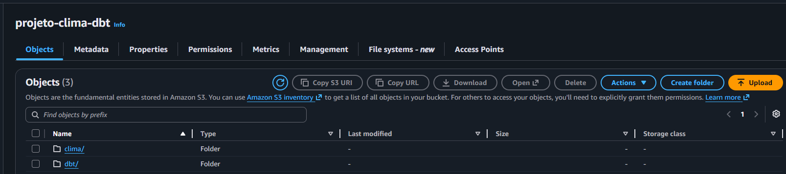


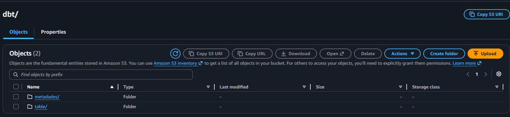

---

# ☁️ 2. Ingestão de Dados com AWS Lambda

## 2.1 Criação da Função Lambda

Foi criada a função:

```text
getAPI-clima
```

Objetivo:

* Consumir a API Visual Crossing
* Receber os dados meteorológicos
* Salvar os arquivos no Amazon S3

Fluxo executado:

```text
Visual Crossing API
        ↓
AWS Lambda
        ↓
Amazon S3
```
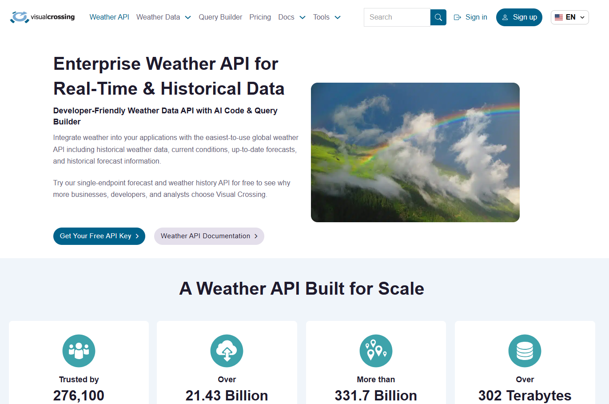

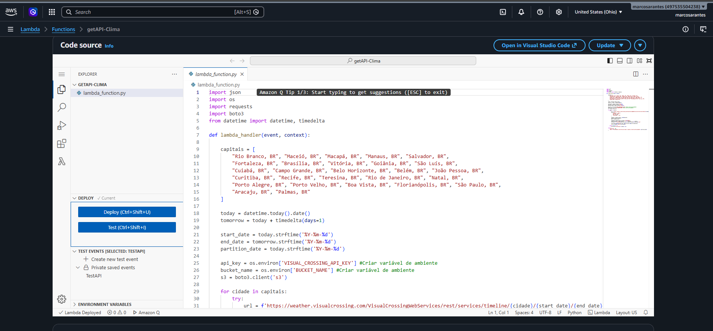

---

## 2.2 Configuração de Permissões IAM

Para permitir a gravação dos arquivos no bucket, foi editada a Role criada automaticamente pela Lambda.

Permissão adicionada:

```text
AmazonS3FullAccess
```

Essa permissão possibilitou:

* Criar arquivos
* Ler arquivos
* Atualizar arquivos
* Gerenciar objetos dentro do bucket

---

# 📂 3. Catalogação dos Dados com AWS Glue

## 3.1 Criação do Crawler

Foi criado um AWS Glue Crawler para automatizar a descoberta dos dados armazenados no S3.

Origem configurada:

```text
s3://projeto-clima-dbt/clima/
```

Configuração:

```text
Crawl new folders only
```

Permitindo que apenas novos arquivos sejam processados.

---

## 3.2 Criação do Database

Foi criado o database:

```text
landing
```

Representando a camada inicial dos dados brutos.

---

## 3.3 Criação da Role do Glue

Role criada:

```text
AWSGlueServiceRole-ClimaDbt
```

Responsável por permitir que o Glue:

* Leia os arquivos do S3
* Atualize o catálogo
* Gerencie metadados

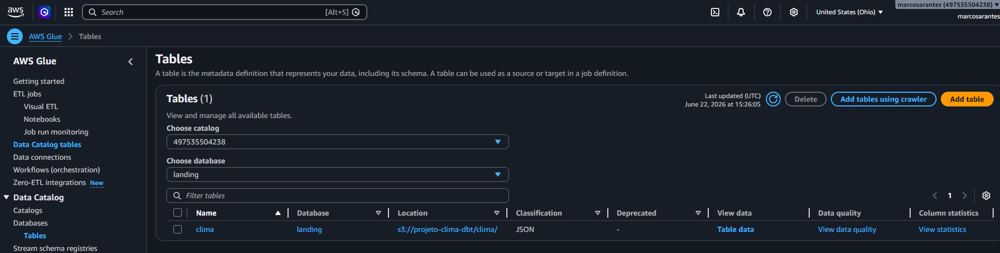

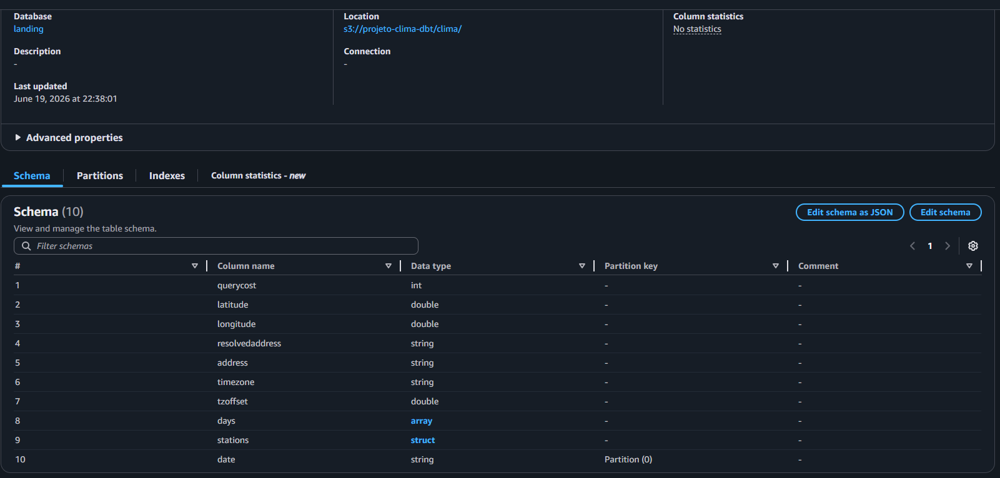

---

# 🔍 4. Consulta dos Dados com Amazon Athena

Após a execução do crawler, as tabelas ficaram disponíveis automaticamente no Athena.

O Athena foi utilizado para:

* Validar ingestão dos dados
* Consultar dados brutos
* Verificar transformações realizadas pelo dbt

Benefícios:

* Não exige provisionamento de servidores
* Consulta direta sobre arquivos armazenados no S3
* Integração nativa com Glue Data Catalog

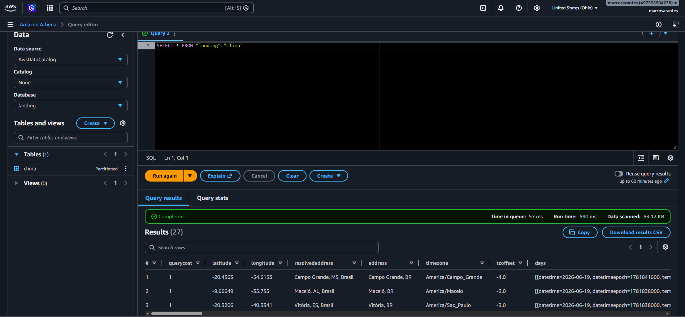

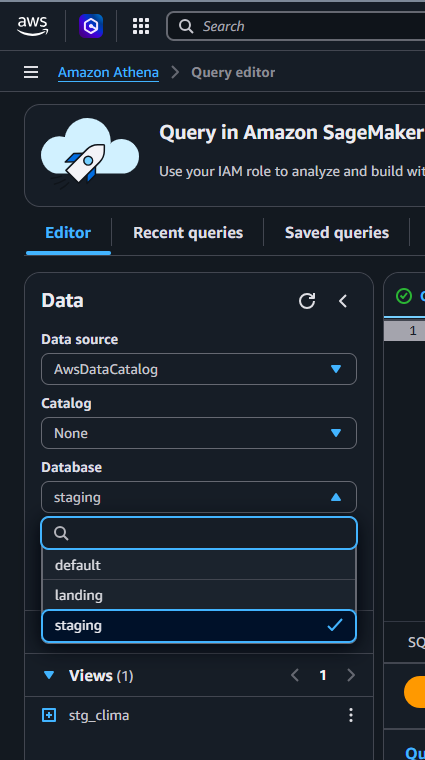
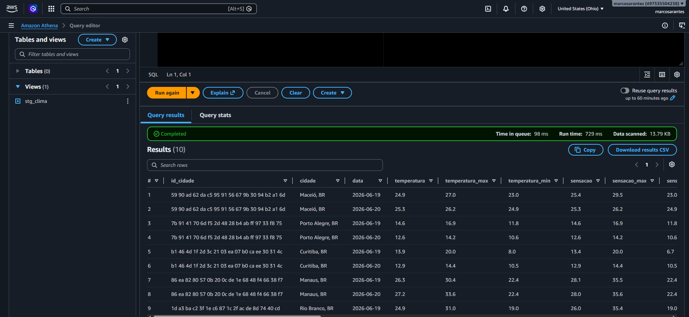

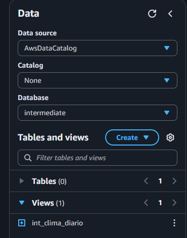
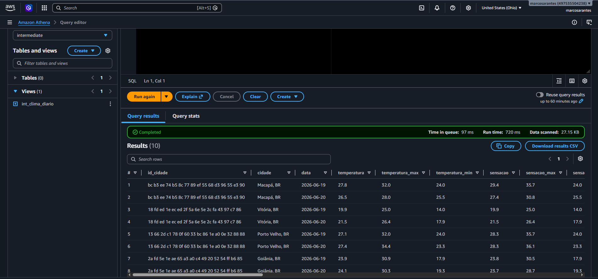

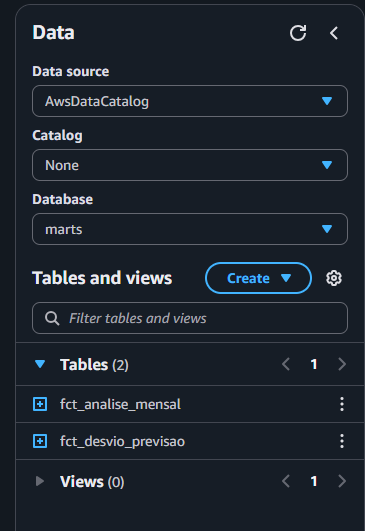
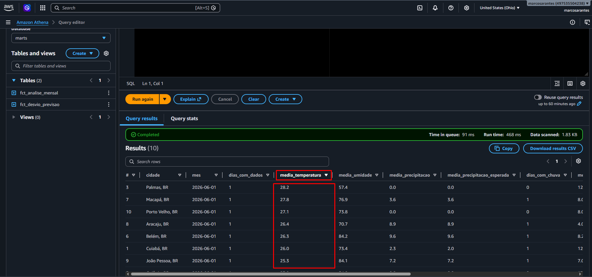

---

# 🛠️ 5. Desenvolvimento do Projeto dbt Core

## 5.1 Criação do Ambiente Local

Foi criado o projeto:

```text
projeto-dbt-aws
```

Passos realizados:

```bash
python -m venv .venv
```

Ativação do ambiente virtual e abertura do projeto no VS Code.

---

## 5.2 Configuração do Athena no dbt

Foi instalada a integração entre:

```text
dbt Core + Athena
```

Para armazenamento dos metadados foi criada a estrutura:

```text
projeto-clima-dbt/

└── dbt/
    └── metadados/
```

O caminho S3 foi utilizado durante a configuração do profile do dbt.

---

# ⚙️ 6. Configuração do dbt_project.yml

O arquivo `dbt_project.yml` é o principal arquivo de configuração do dbt Core.

Foi utilizado para:

* Organizar as camadas do projeto
* Definir materializações
* Configurar schemas
* Integrar macros
* Gerar documentação automática

Exemplo:

```yaml
models:

  staging:
    +materialized: view

  intermediate:
    +materialized: table

  marts:
    +materialized: table
```

---

# 📊 7. Arquitetura Analítica com dbt

O projeto foi organizado utilizando a arquitetura Medallion.

## 🟫 Camada Staging

Responsável por:

* Padronização de colunas
* Renomeação de campos
* Conversão de tipos
* Limpeza inicial

Exemplo:

```text
stg_clima
```

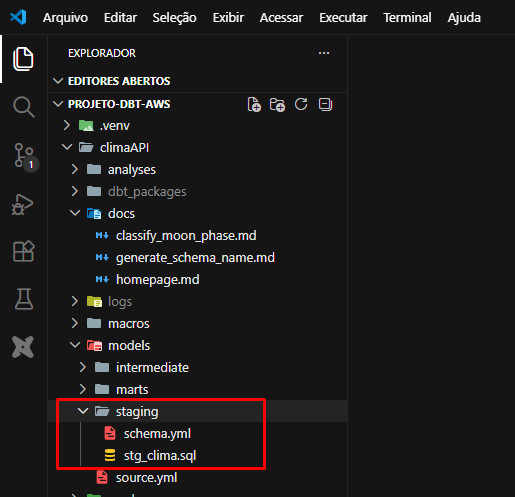

---

## ⬜ Camada Intermediate

Responsável por:

* Regras de negócio
* Transformações intermediárias
* Criação de métricas auxiliares

Exemplo:

```text
int_clima
```

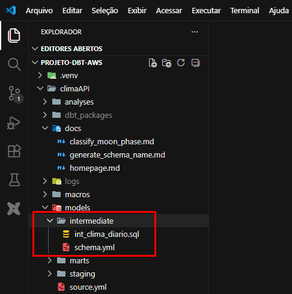

---

## 🟨 Camada Marts

Responsável por:

* Consumo analítico
* Disponibilização para BI
* Indicadores finais

Exemplo:

```text
mart_clima
```

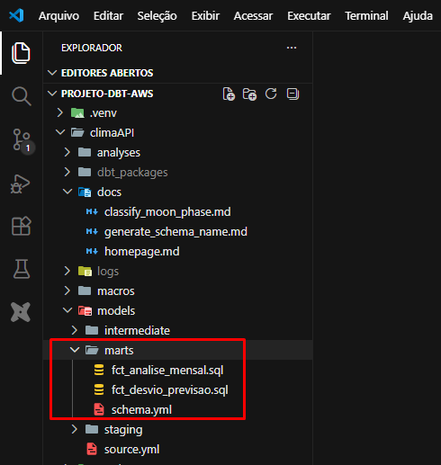

---

# 📄 8. Arquivos Schema.yml

Foram criados arquivos `schema.yml` em cada camada.

Objetivos:

* Documentar modelos
* Descrever colunas
* Aplicar testes automáticos

Exemplos de testes:

* not_null
* unique
* accepted_values

---

# 🔄 9. Macros Desenvolvidas

## classify_moon_phase.sql

Macro responsável por classificar automaticamente as fases da lua.

Exemplos:

* New Moon
* First Quarter
* Full Moon
* Last Quarter

---

## generate_schema_name.sql

Macro utilizada para controlar a geração dos schemas dentro do Athena.

Benefícios:

* Organização das camadas
* Padronização dos objetos
* Melhor governança dos dados

---

# ▶️ 10. Execução do Projeto

Execução dos modelos:

```bash
dbt run
```

Execução dos testes:

```bash
dbt test
```

Geração da documentação:

```bash
dbt docs generate
```

Visualização da documentação:

```bash
dbt docs serve
```

---

# 📚 11. Documentação Automática do dbt

Foi utilizada a funcionalidade nativa do dbt para geração da documentação.

Benefícios:

* Linhagem dos modelos
* Dependências entre tabelas
* Descrição dos campos
* Navegação visual do projeto

---

# 📈 12. Resultado Final

Ao final da execução do pipeline:

✅ Dados coletados automaticamente da API Visual Crossing

✅ Armazenamento dos arquivos no Amazon S3

✅ Catalogação automática pelo AWS Glue

✅ Disponibilização das tabelas no Amazon Athena

✅ Transformações realizadas com dbt Core

✅ Arquitetura Bronze → Silver → Gold implementada

✅ Documentação automática gerada pelo dbt

✅ Projeto versionado no GitHub

---

# 📂 Estrutura do Projeto

```text
projeto-dbt-aws/

├── models/
│
├── staging/
│   ├── stg_clima.sql
│   └── schema.yml
│
├── intermediate/
│   ├── int_clima.sql
│   └── schema.yml
│
├── marts/
│   ├── mart_clima.sql
│   └── schema.yml
│
├── macros/
│   ├── classify_moon_phase.sql
│   └── generate_schema_name.sql
│
├── target/
├── dbt_project.yml
├── profiles.yml
└── README.md
```

---

# 🎯 Principais Conceitos Aplicados

* Engenharia de Dados
* Data Lake
* Arquitetura Medallion
* AWS Lambda
* Amazon S3
* AWS Glue
* Glue Data Catalog
* Amazon Athena
* dbt Core
* Engenharia Analítica
* Modelagem de Dados
* Data Governance
* Documentação de Dados
* Versionamento com GitHub
